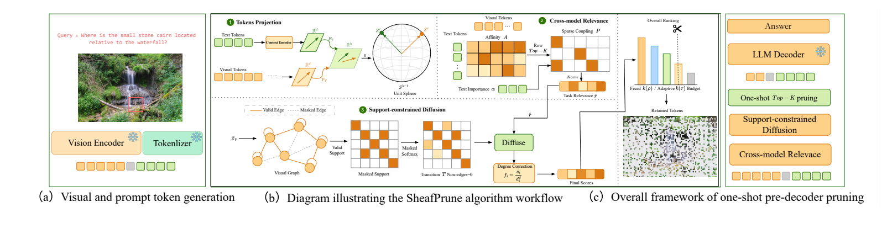
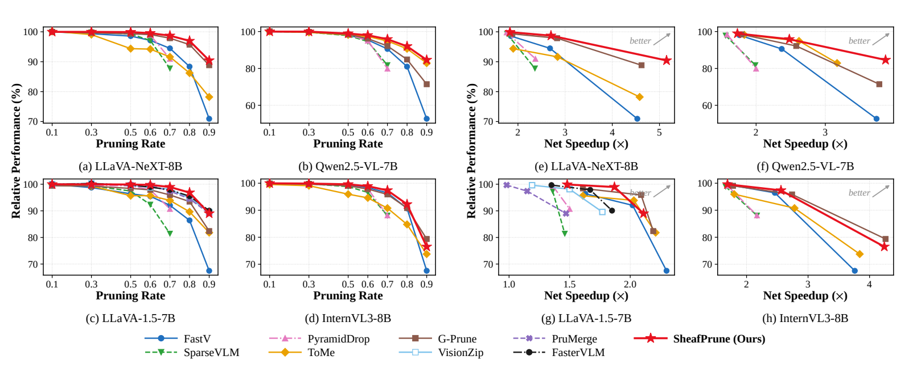
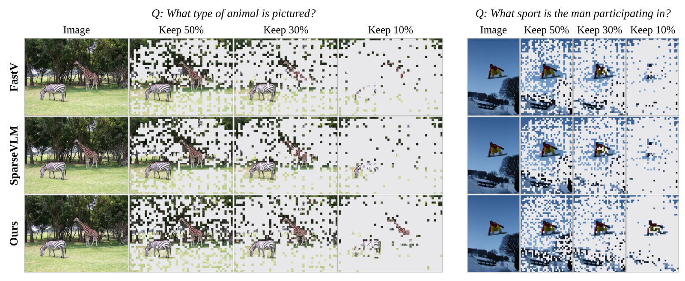
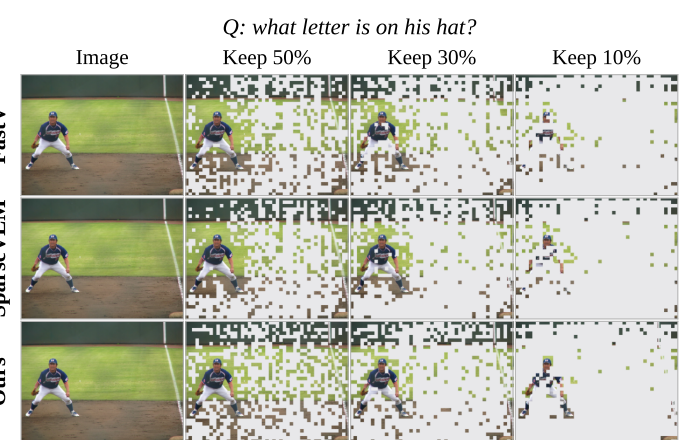
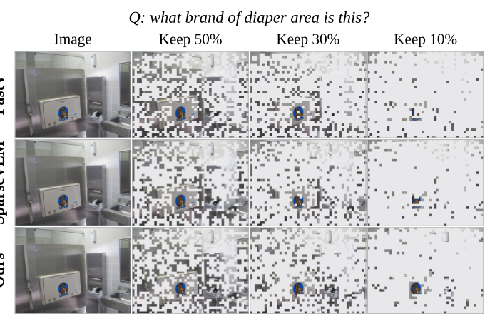

  <strong style="font-size: 2.2em;">SheafPrune</strong> 
  <em>Question-aware visual token pruning for efficient multimodal reasoning</em>

  <a href="README_zh-CN.md">简体中文</a> · <strong>English</strong>

  <strong>Code: Coming soon</strong>   ·   <strong>Weights: Coming soon</strong>

## Overview

High-resolution images can flood a vision-language model with visual tokens that are irrelevant to the question. **SheafPrune keeps the evidence that matters and removes the rest before decoding.** It combines cross-modal relevance with visual structure, diffuses the resulting scores over a support-constrained graph, and performs one-shot Top-K selection before the language model sees the image tokens.

The design keeps the backbone frozen and concentrates learning in a lightweight pruning module. The retention budget is explicit, so the same model can trade visual context for latency at inference time.

| What the paper reports      |                                                                             Result |
| :-------------------------- | ---------------------------------------------------------------------------------: |
| Backbone families           |                        4: LLaVA-NeXT-8B, Qwen2.5-VL-7B, LLaVA-1.5-7B, InternVL3-8B |
| Benchmark suite             |                                                           10 multimodal benchmarks |
| Best-δ envelope wins       |                                        **22 / 28** backbone–budget settings |
| LLaVA-NeXT at 10% retention |                                    **90.42%** relative performance retention |
| Same setting                | **5.15×** net prefill speedup · **84.0%** end-to-end FLOPs reduction |

## How SheafPrune selects tokens

  

1. **Project the question and the image.** Text and visual tokens are mapped into a shared normalized space, conditioned on the requested retention budget.
2. **Transfer relevance across modalities.** A sparse text–vision coupling graph propagates question importance to visual tokens.
3. **Respect visual support.** The relevance signal is fused with a visual prior and diffused on a support-constrained visual graph, preserving coherent evidence.
4. **Prune once, before decoding.** The final scores drive budgeted Top-K selection; discarded visual tokens never enter the language-model prefill sequence.

This is the central idea: pruning is driven by the question, while the graph structure keeps the selected evidence spatially meaningful.

## Results across four backbones

  

The figure reports the paper's **best-δ performance envelope**: for each pruning budget, the strongest δ configuration is shown. It should be read as a comparison of achievable operating points, rather than as one fixed-δ deployment curve.

At the aggressive **10% retention / 90% pruning** point on LLaVA-NeXT, SheafPrune retains **90.42%** relative performance, reaches **5.15×** net prefill speedup, and reduces end-to-end FLOPs by **84.0%**. At **70% pruning**, it still retains **98.7%** performance with **2.70×** net prefill speedup.

## Qualitative evidence at tight budgets

These examples are taken from the paper and lightly cropped for README presentation. The masks show what remains visible to the model as the retention budget drops from 50% to 10%; **Ours** denotes SheafPrune.

  

The two tasks above test global scene understanding. The close-up cases below stress the opposite failure mode: a tiny region must survive because it contains the answer.

<table>
  <tr>
    <td align="center" width="50%"> Fine-grained text evidence: a letter on the hat</td>
    <td align="center" width="50%"> Localized visual evidence: a small brand mark</td>
  </tr>
</table>

At 10% retention, the retained regions remain concentrated around the queried subject instead of spreading uniformly across the image. That is the practical value of question-aware pruning: fewer tokens, while the answer-bearing pixels stay in the sequence.

## Scope

The paper evaluates SheafPrune with **LLaVA-NeXT-8B, Qwen2.5-VL-7B, LLaVA-1.5-7B, and InternVL3-8B** on **ChartQA, DocVQA, TextVQA, HR-Bench 4K, HR-Bench 8K, GQA, VQAv2, MMBench-EN, POPE, and MME**.

## Release status

| Resource                                         | Status                       |
| :----------------------------------------------- | :--------------------------- |
| Paper figures and method summary                 | Available in this repository |
| Training and inference code                      | **Coming soon**        |
| Pretrained SheafPrune weights                    | **Coming soon**        |
| Reproduction instructions and evaluation scripts | **Coming soon**        |

The code and checkpoints will be released in this repository. Backbone models and benchmark datasets remain subject to their original licenses.

---

Keep the evidence. Prune the rest.

