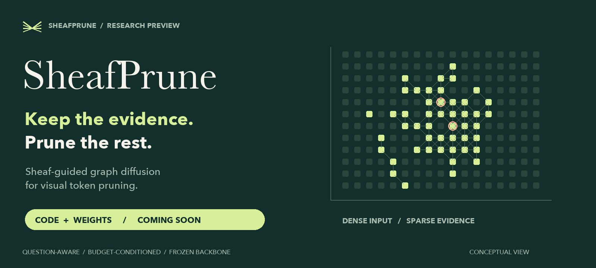
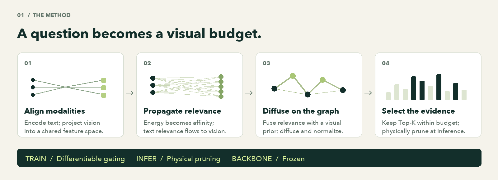
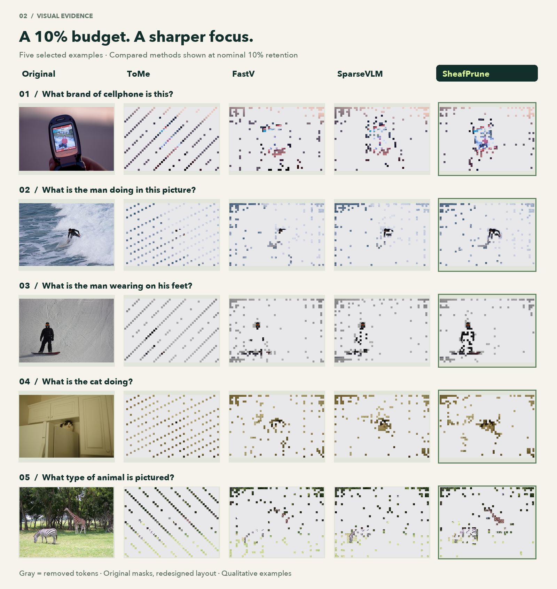
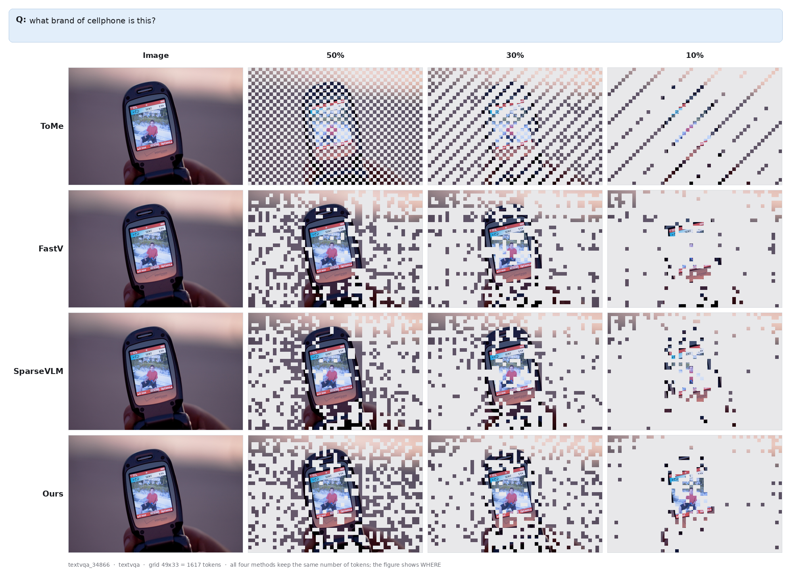
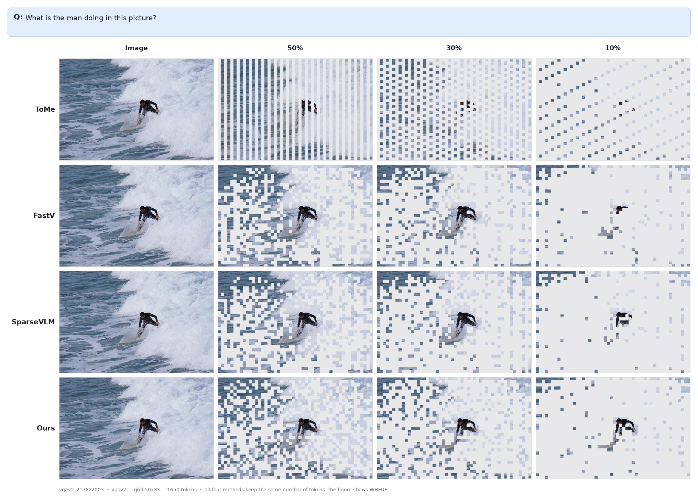
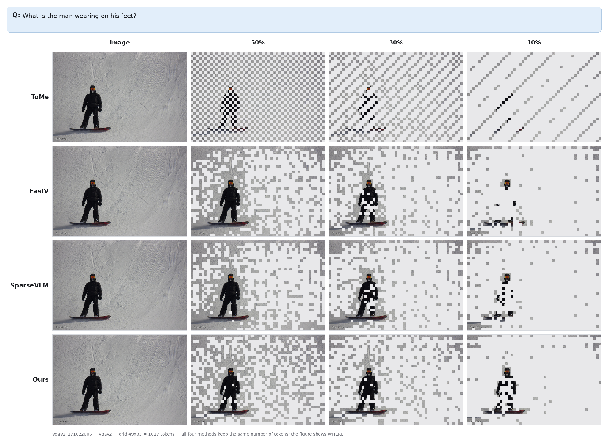
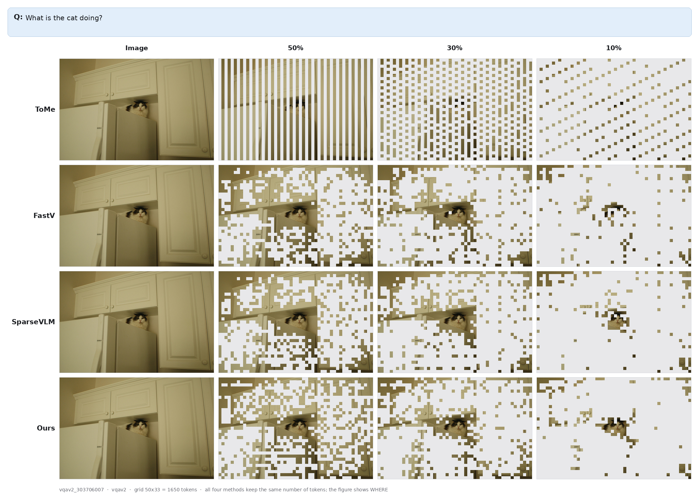
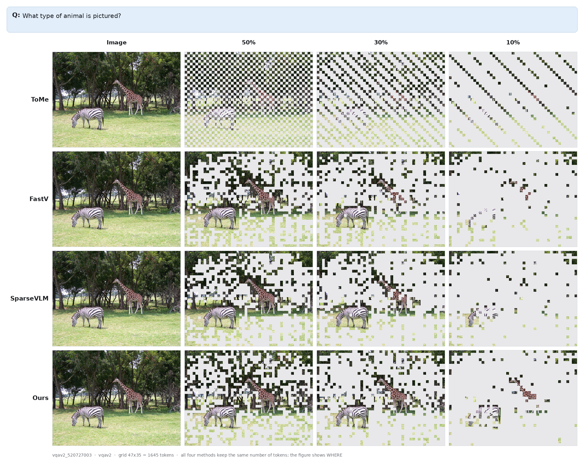

  

  <strong>English</strong> · <a href="README_zh-CN.md">简体中文</a>

  <a href="#overview">Overview</a>   /  
  <a href="#method">Method</a>   /  
  <a href="#visualizations">Visualizations</a>   /  
  <a href="#results">Results</a>   /  
  <a href="#release">Release</a>

> **Code: Coming soon. &nbsp; Model weights: Coming soon.**
>
> This repository currently presents the method and selected visualizations. The implementation and trained SheafPrune checkpoints will be released here.

## Less to process. More to focus on.

High-resolution images can contribute thousands of visual tokens to a vision-language model. Yet a question may depend on only a small part of that image: a brand name, an animal, or the equipment beneath a person's feet.

**SheafPrune selects visual tokens before they enter the language model.** It combines sheaf-derived cross-modal relevance with a visual prior, refines scores through graph diffusion, and retains a budgeted Top-K subset. The vision encoder, multimodal projector, and language model remain frozen while the lightweight pruning module is trained.

<table>
  <tr>
    <td align="center" width="33%"><h3>50%</h3>visual tokens pruned</td>
    <td align="center" width="34%"><h3>99.18%</h3>reported performance retention</td>
    <td align="center" width="33%"><h3>1.74×</h3>reported net prefill speedup</td>
  </tr>
</table>

Reported in the project evaluation summary for LLaVA-NeXT-8B at 50% nominal pruning. Performance retention is relative to the unpruned baseline; it is not absolute accuracy. See <a href="#results"> for scope and measurement notes.Results

### [Designed around the question](#results)

- [**Cross-modal relevance.** A budget-conditioned text encoder and sheaf projections connect the question to visual evidence.](#results)
- [**Structure-aware selection.** Visual graph diffusion combines cross-modal relevance with a visual feature-norm prior before ranking tokens.](#results)
- [**A lightweight trainable module.** The project reports approximately **4.5M trainable parameters**, with the backbone frozen.](#results)
- [**Adjustable inference budgets.** A retention-ratio input controls how many candidate tokens survive; inference physically removes discarded tokens.](#results)

## From relevance to a smaller sequence

  

1. **Align text and vision.** Encode the question with a retention-ratio condition, then project text and visual features into a shared normalized space.
2. **Build cross-modal relevance.** Convert pairwise edge energies into affinities. Sparsify the text–vision graph, normalize its degrees, and propagate text importance to visual tokens.
3. **Refine on the visual graph.** Fuse cross-modal relevance with a visual feature-norm prior. Diffuse over visual similarities and apply degree normalization.
4. **Keep the budgeted evidence.** Rank candidate tokens and select Top-K. Training uses differentiable gating; inference physically shortens the sequence while preserving token order and positional information.

<strong>A closer look at the cross-modal energy</strong>

For normalized projected text and visual features, the implementation computes

$$
E_{ji}=2-2\langle \hat{z}^{\,t}_j,\hat{z}^{\,v}_i\rangle,
\qquad
A_{ji}=\exp(-E_{ji}/\tau_E).
$$

Lower energy produces stronger affinity. Text-importance weights then propagate over a sparse, degree-normalized affinity graph to produce visual relevance scores. These scores are fused with the visual prior before graph diffusion and final selection.

The budget applies to **candidate visual tokens**. Required structural tokens may be retained separately, so nominal and realized whole-sequence retention can differ.

## Just 10% of the tokens. Look at what remains.

At **90% nominal pruning**, every retained region counts. These five selected examples put the tightest supplied budget side by side: follow the phone, the surfer, the snowboarder, the cat, and the animals through each method’s retained tokens.

  

**What to look for:** the concentration and continuity of retained regions around the main subjects. The figures use the original token masks in a redesigned layout; gray regions mark removed tokens. These selected qualitative examples illustrate token selection, not answer accuracy or an aggregate ranking.

### Explore all three budgets

Expand a case to compare **ToMe · FastV · SparseVLM · SheafPrune** at the displayed 50%, 30%, and 10% retention settings. “Ours” in the original figures denotes SheafPrune. Each image links to its full-resolution version.

<strong>01 · Reading a brand</strong> — What brand of cellphone is this?

**TextVQA** · A localized text-recognition example with a small brand region on the device.

<strong>02 · Recognizing an action</strong> — What is the man doing in this picture?

**VQAv2** · A person and an action embedded in a textured background of waves.

<strong>03 · Looking at the equipment</strong> — What is the man wearing on his feet?

**VQAv2** · A question about a specific body region and its nearby equipment.

<strong>04 · Finding the subject indoors</strong> — What is the cat doing?

**VQAv2** · A small animal within a scene dominated by cabinets and strong background edges.

<strong>05 · Recognizing an animal</strong> — What type of animal is pictured?

**VQAv2** · Object recognition in an outdoor scene with vegetation and background structure.

## A smaller budget, measured

With **half the candidate visual tokens removed**, the project reports **99.18% performance retention**. At **90% nominal pruning**, it reports **87.97% retention** and **5.15× net prefill speedup** on **LLaVA-NeXT-8B**.

| Nominal tokens kept | Nominal tokens pruned | SheafPrune performance retention | Random selection retention | Net prefill speedup |
| :-----------------: | :-------------------: | :------------------------------: | :------------------------: | :-----------------: |
|    **10%**    |          90%          |         **87.97%**         |           72.50%           |   **5.15×**   |

Reported project results, transcribed from the existing evaluation summary. Raw evaluation logs are not included in this preview. “—” indicates a value not provided in that summary.

**Evaluation scope.** The project documentation describes 9 benchmarks and 12,438 evaluation samples: **GQA, VQAv2, POPE, TextVQA, DocVQA, ChartQA, MME, MMBench-EN, and HR-Bench 4K**.

**How to read the numbers.** Performance retention is measured relative to the unpruned model under the documented protocol. The reported speedups refer to **prefill**, include the pruning module's overhead, and should not be interpreted as end-to-end generation speedups. Structural tokens can make realized retention differ from the nominal candidate-token budget. Results depend on the model, hardware, and evaluation setup.

### Backbone integrations

The implementation includes adapters for the following model families. The numerical results above refer specifically to LLaVA-NeXT-8B.

| Backbone   | Model scale | Public implementation |
| :--------- | :---------: | :-------------------: |
| LLaVA-NeXT |     8B     |      Coming soon      |
| Qwen2.5-VL |     7B     |      Coming soon      |
| InternVL3  |     8B     |      Coming soon      |
| LLaVA-1.5  |     7B     |      Coming soon      |

## Code & weights — Coming soon

| Resource                                                       | Status                        |
| :------------------------------------------------------------- | :---------------------------- |
| Method overview and selected visualizations                    | Available in this repository  |
| SheafPrune source code                                         | **Coming soon**         |
| Trained SheafPrune weights / checkpoints                       | **Coming soon**         |
| Installation, inference, training, and evaluation instructions | To accompany the code release |

This is a research preview. Download links and runnable instructions will be added when the corresponding resources are available. Pretrained backbone models and datasets remain subject to their respective licenses.

---

  <strong>SheafPrune</strong> 
  Keep the evidence. Prune the rest.  
  <a href="README_zh-CN.md">阅读中文版</a> · <a href="#overview">Back to overview</a>

