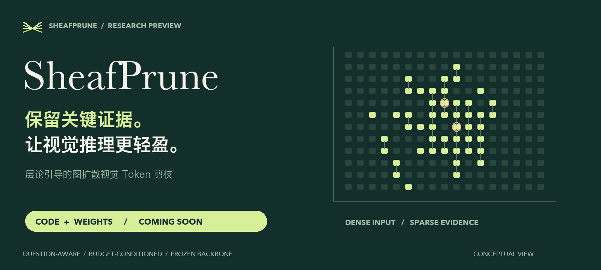
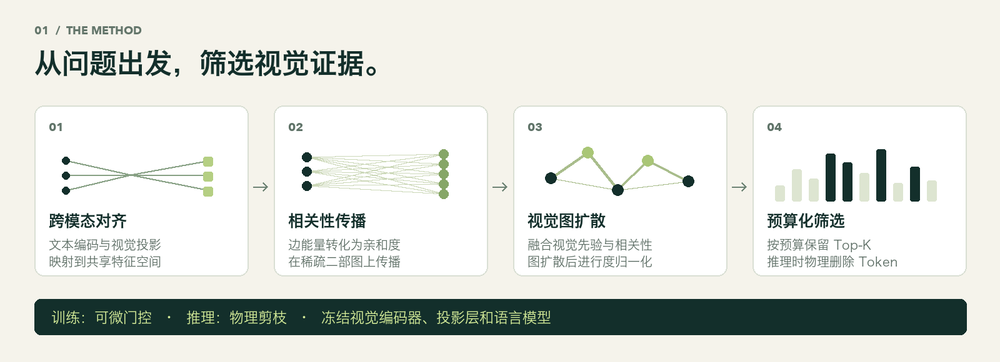
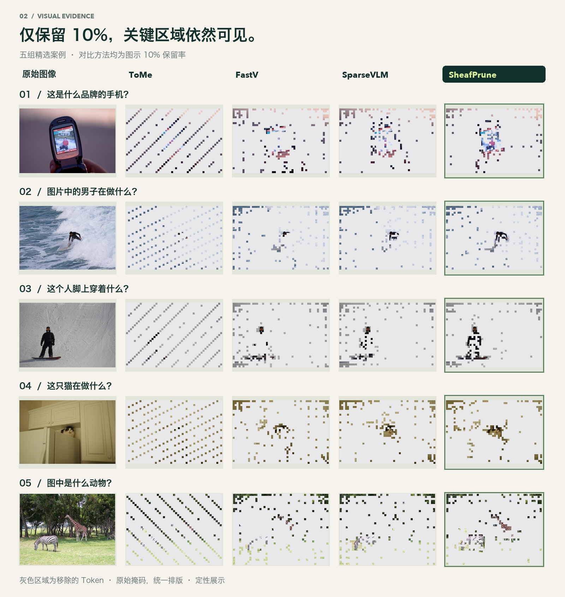

  

  <a href="README.md">English</a> · <strong>简体中文</strong>

  <a href="#overview">项目概览</a> &nbsp; / &nbsp;
  <a href="#method">方法原理</a> &nbsp; / &nbsp;
  <a href="#visualizations">可视化</a> &nbsp; / &nbsp;
  <a href="#results">实验结果</a> &nbsp; / &nbsp;
  <a href="#release">发布计划</a>

> **代码：Coming soon。 &nbsp; 模型权重：Coming soon。**
>
> 当前仓库展示方法概览与精选可视化。完整实现和训练后的 SheafPrune 权重将在此发布。

## 更少的计算，更聚焦的视觉证据。

一张高分辨率图像可能为视觉语言模型带来数千个视觉 Token，而回答一个问题，往往只需要其中的一小部分：手机上的品牌、画面中的动物，或人物脚下的装备。

**SheafPrune 在视觉 Token 进入语言模型之前完成筛选。** 方法将层论（sheaf）导出的跨模态相关性与视觉先验融合，经图扩散细化分数，再按预算保留 Top-K Token。训练时仅更新轻量剪枝模块，视觉编码器、多模态投影层和语言模型均保持冻结。

<table>
  <tr>
    <td align="center" width="33%"><h3>50%</h3>视觉 Token 剪枝比例</td>
    <td align="center" width="34%"><h3>99.18%</h3>文档报告的性能保持率</td>
    <td align="center" width="33%"><h3>1.74×</h3>文档报告的 Prefill 净加速</td>
  </tr>
</table>

数据来自项目评测汇总，对应 LLaVA-NeXT-8B、名义剪枝率 50% 的设置。性能保持率相对于未剪枝基线，不代表绝对准确率。评测范围与测量口径见<a href="#results">实验结果</a>。

### 围绕问题，保留证据

- **跨模态相关性。** 通过保留率条件化的文本编码器与 Sheaf 投影，将问题与视觉证据关联。
- **考虑视觉结构。** 将跨模态相关性与视觉特征范数先验融合，通过视觉图扩散细化 Token 排序。
- **轻量可训练模块。** 项目文档报告约 **4.5M 可训练参数**，主干模型保持冻结。
- **可调推理预算。** 保留率输入控制候选 Token 的保留数量；推理时物理删除被筛掉的 Token。

## 从相关性，到更短的输入序列

  

1. **对齐文本与视觉。** 编码问题并注入目标保留率，将文本和视觉特征投影到共享的归一化特征空间。
2. **构建跨模态相关性。** 将成对边能量转化为亲和度，构建稀疏图文二部图，经过度归一化，将文本重要性传播到视觉 Token。
3. **在视觉图上细化分数。** 融合跨模态相关性与视觉特征范数先验，在视觉相似图上扩散，再进行度归一化。
4. **按预算保留证据。** 对候选 Token 排序并选取 Top-K。训练时使用可微门控；推理时物理缩短序列，保留 Token 原有顺序与位置信息。

<strong>进一步理解跨模态边能量</strong>

对于归一化后的文本与视觉投影特征，实现中计算：

$$
E_{ji}=2-2\langle \hat{z}^{\,t}_j,\hat{z}^{\,v}_i\rangle,
\qquad
A_{ji}=\exp(-E_{ji}/\tau_E).
$$

边能量越低，亲和度越高。文本重要性权重沿稀疏、度归一化的亲和图传播，形成视觉相关性分数。随后将该分数与视觉先验融合，再进行图扩散与最终筛选。

预算作用于**候选视觉 Token**。必要的结构 Token 可能单独保留，因此名义保留率与完整序列的实际保留率可能不同。

## 只留下 10%，看看还保留了什么。

当**名义剪枝率达到 90%**，每一块留下的区域都值得关注。五组精选案例将素材中最紧的预算并排呈现：沿着手机、冲浪者、滑雪者、猫和动物所在的位置，观察各方法留下的视觉信息。

  

**建议关注：**主体附近保留区域的集中程度与连续性。图片使用原始 Token 掩码重新排版，灰色区域表示被移除的 Token。精选案例用于定性展示选择效果，不代表回答准确率或总体性能排名。

### 展开查看三档预算

展开案例，可查看 **ToMe · FastV · SparseVLM · SheafPrune** 在图示 50%、30%、10% 保留设置下的对比。原图中的“Ours”指 SheafPrune，点击图片可查看完整分辨率版本。

<strong>01 · 读取品牌</strong> — 这是什么品牌的手机？

**TextVQA** · 品牌区域较小，展示局部文字识别场景。

<strong>02 · 理解人物动作</strong> — 图片中的男子在做什么？

**VQAv2** · 在纹理丰富的海浪背景中识别人物与动作。

<strong>03 · 关注运动装备</strong> — 这个人脚上穿着什么？

**VQAv2** · 问题指向特定身体部位及其附近的装备。

<strong>04 · 寻找室内主体</strong> — 这只猫在做什么？

**VQAv2** · 橱柜和背景边缘占据大部分画面，动物主体较小。

<strong>05 · 识别动物类别</strong> — 图中是什么动物？

**VQAv2** · 含有植被与背景结构的户外物体识别场景。

## 用更小的预算，衡量实际表现

**移除一半候选视觉 Token，性能保持率为 99.18%。** 当**名义剪枝率达到 90%**，项目报告在 **LLaVA-NeXT-8B** 上仍保有 **87.97% 的性能保持率**，同时实现 **5.15× Prefill 净加速**。

| 名义保留率 | 名义剪枝率 | SheafPrune 性能保持率 | 随机选择性能保持率 | Prefill 净加速 |
|:---:|:---:|:---:|:---:|:---:|
| **10%** | 90% | **87.97%** | 72.50% | **5.15×** |

数据转录自现有项目评测汇总，本预览尚未包含原始评测日志。“—”表示汇总材料未给出该设置下的数值。

**评测范围。** 项目文档描述了 9 个基准、共 12,438 条评测样本：**GQA、VQAv2、POPE、TextVQA、DocVQA、ChartQA、MME、MMBench-EN 和 HR-Bench 4K**。

**数字的含义。** 性能保持率相对于文档评测协议下的未剪枝模型。所报告的加速针对 **Prefill 阶段**，已计入剪枝模块自身开销，不等同于端到端生成加速。结构 Token 的保留可能使实际保留率偏离候选 Token 的名义预算。结果取决于模型、硬件和评测设置。

### 主干模型适配

实现中包含以下模型系列的适配器。上方数值结果仅对应 LLaVA-NeXT-8B。

| 主干模型 | 模型规模 | 公开实现 |
|:---|:---:|:---:|
| LLaVA-NeXT | 8B | Coming soon |
| Qwen2.5-VL | 7B | Coming soon |
| InternVL3 | 8B | Coming soon |
| LLaVA-1.5 | 7B | Coming soon |

## 代码与权重 — Coming soon

| 资源 | 状态 |
|:---|:---|
| 方法概览与精选可视化 | 已在当前仓库提供 |
| SheafPrune 源代码 | **Coming soon · 即将发布** |
| 训练后的 SheafPrune 权重 / Checkpoints | **Coming soon · 即将发布** |
| 安装、推理、训练与评测说明 | 随代码发布提供 |

当前为研究预览版本。相应资源可用后，将补充下载链接与可运行的使用说明。预训练主干模型及数据集遵循各自的许可协议。

---

  <strong>SheafPrune</strong> 
  保留关键证据，让视觉推理更轻盈。  
  <a href="README.md">Read in English</a> · <a href="#overview">返回项目概览</a>

